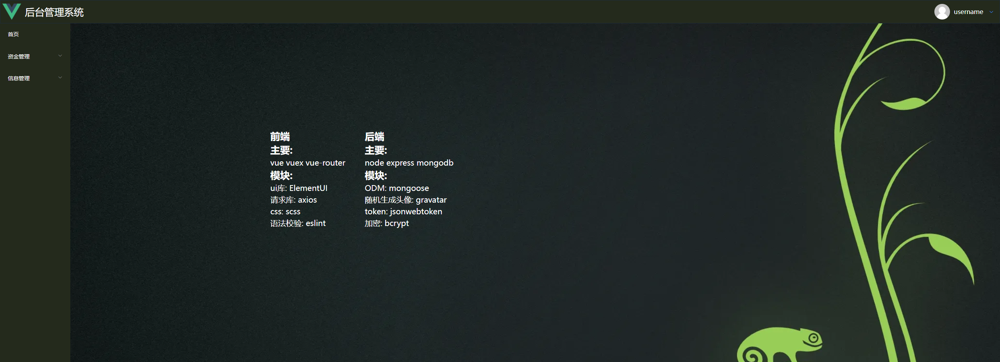
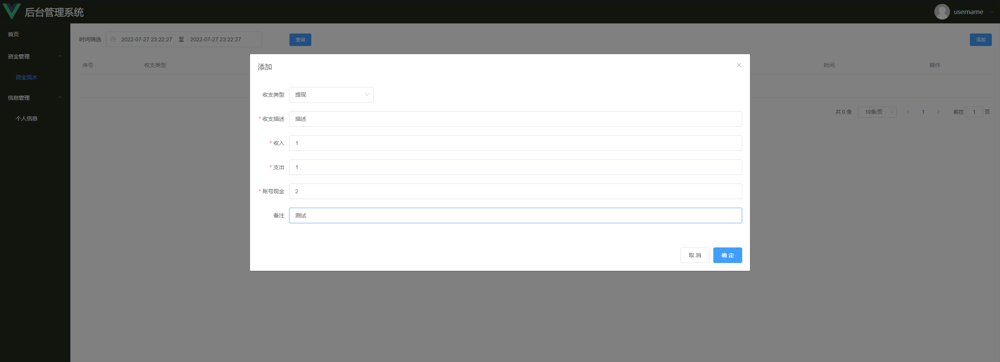
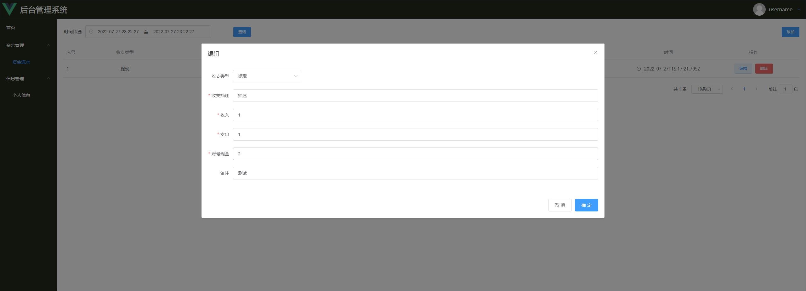
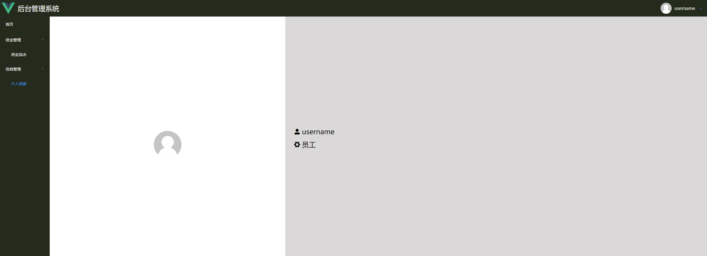

## Vue+node.js 全栈项目-资金管理系统带权限 前端

学习视频地址 https://www.bilibili.com/video/BV1R341167Fw?spm_id_from=333.337.search-card.all.click

## 一、技术栈

该项目前端主要使用`vue`搭配`element-ui`采用组件化的方式开发完成,此外项目中陆续使用有

- jwt-decode
- vue-router
- vuex
- sass
- eslint

该项目后端主要使用`node`搭配`express`采用组件化的方式开发完成,此外项目中陆续使用有

- bcrypt
- gravatar
- jsonwebtoken
- mongoose
- passport/passport-jwt

## 二、运行效果截图

#### 1 注册

#### 2 首页

#### 3 资金管理/增加

#### 4 资金管理/改查删

#### 5 用户信息静态页

